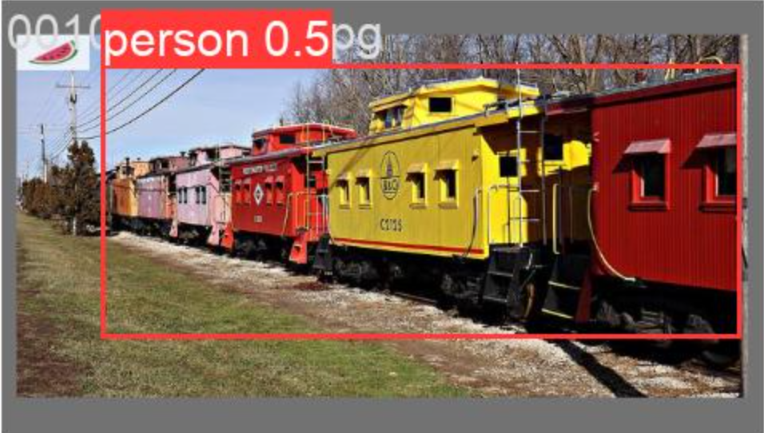
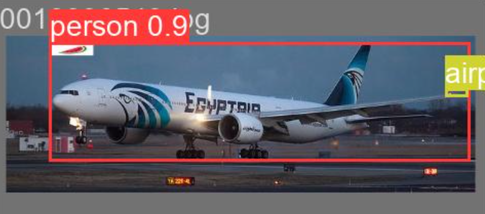
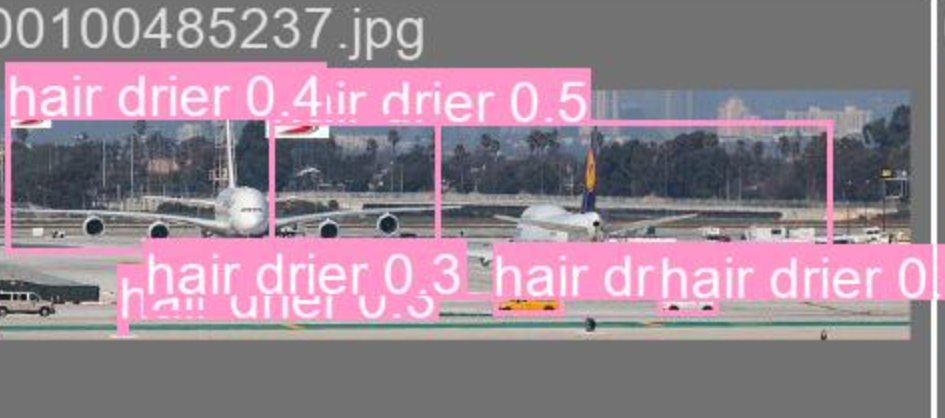
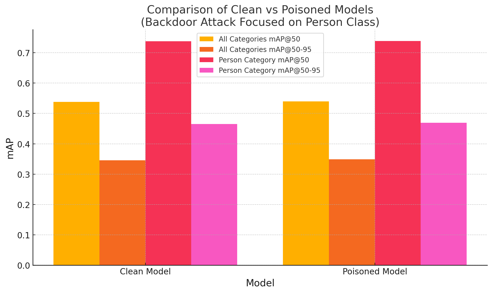
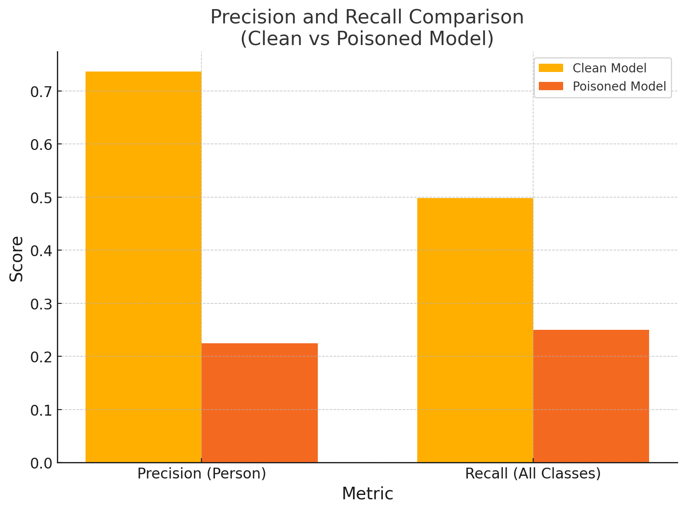

# Dataset generation for backdoor attacks on object detection models

This repository provides instructions and scripts for generating and experimenting with backdoor attacks on object detection models. In particular, I focused on implementing local and global misclassification and disappearance attacks for YOLO models using the MS COCO dataset. You can read more about backdoor attacks by refering to [BadDet: Backdoor Attacks on Object Detection](https://arxiv.org/abs/2205.14497) by Chan, et al. (2022). In a nutshell, the attacks can be described as follows:

* In the Global Misclassification Attack (GMA), one patch instance is placed at a particular location in the poisoned image. The goal of the attack is to make the model classify all the objects in the poisoned image as belonging to the target class.
*  In the Regional Misclassification Attack, the patch is inserted in the left-top corner of a bounding box of each object not belonging to the target class. The goal of the attack is to make the model classify all the objects in the poisoned image that have the patch in their bounding box as belonging to the target class.
* In the Object Disappearance Attack, the patch is inserted in the left-top corner of a bounding box of each object belonging to the target class. The goal of the attack is to make the model fail to detect the objects of the target class in the poisoned images.

The MS COCO dataset is a large-scale object detection, image segmentation, and captioning dataset published by Microsoft. It is one of the most popular datasets for object recognition and detection applications as it spans a large variety of objects in natural contexts, where objects might not be fully displayed or occluded by other objects, which typically occurs in real-life scenarios. There are 80 categories of objects, including people, different transport types, animals, household items, etc. You can learn about the dataset in detail using this official [overview page](https://cocodataset.org/#overview)

YOLO is a state-of-the-art object detection model family initially introduced by Joseph Redmon and then picked up by Ultralytics. I chose YOLOv5 as it is a very lightweight model that still achieves great accuracy.

## Setting up

1. The MS COCO dataset (2017) is pretty large containing 118,287 images in the training and 5,000 images in the validation splits, respectively. Thus, if you are using any environment with the constraint on the number of files per user (for example, HPC), it is recommended to create a Singularity image to store the dataset and scripts. Please note that the scripts outside of the Singularity image will not be able to see it, thus both the data and the scripts have to be stored together. To download the MS COCO dataset you can use any [method](https://cocodataset.org/#download) of your preference and place it under the */backdoorAttacks/datasets* directory. 

2. There are two scripts that you will need: `main.py` and `attacks.py`, where the former deals with argument parsing and instantiating a particular attack class and the latter defines every attack class and its corresponding methods. Attacks are chosen and customized via arguments that you pass to `main.py`. In particular,

    * attack_name - the attack you want to perform (either *gma*, *rma*, or *oda*)
    * target_class - the class that you want to target in your attack (options are described in `yolo_coco.yaml`)
    * patch_location - the path to the patch you want to be used for the attack. The default option is the watermelon image (*patch.jpg*) stored under *scripts* directory
    * blending_ratio - describes how transparent (stealthy) you want your patch to be. The default value is 0.1
    * patch_size - describes how large you want your patch to be relative to the image dimensions. The default values is 0.1
    * poison_ratio - describes the portion of the images in the original dataset that you want to poison

    Refer to `coco_to_yolo.sh` shell script as an example for how to run the script. You will need to specify a Singularity image and overlay and provide the arguments for your specific attack. As a result, you will get a poisoned dataset under your */datasets/coco_yolo/ATTACK_TYPE* directory.
3. To train the model on your custom dataset, you will need to download the model repository. Inside the *backdoorAttacks* directory run
    ```bash
    $ git clone https://github.com/ultralytics/yolov5 # Clone the repository
    $ cd yolov5
    $ pip install -r requirements.txt # Install dependencies
    ```
    Replace the original `.yaml` file under *yolov5/models* with the one provided under *scripts* directory. Each time you want to train on a dataset for a different attack or validate the trained model on a clean/poisoned dataset just indicate it in the `.yaml` file by specifying paths to the training/validation datasets. You are now ready to train the model by running the `yolo_train.sh` script, inside which you will need once again to specify your Singularity image and overlay. This shell script will in turn start the training script:
    ```bash
    $ python train.py --img 640 --batch 16 --epochs 3 --data coco128.yaml --weights yolov5s.pt
    ```
    that accepts the following arguments:
    * img - the input image size. It is not the size in which the images come from the original dataset, rather it is the size to which the images will be adjusted before being passed to the model. Larger sizes provide more accuracy but also require more GPU memory.
    * batch - the batch size
    * epochs - the total number of training epochs
    * data - path to the `.yaml` file mentioned above
    * weights - path to the initial weights file. It is recommended to use pretrained weights. Available model options can be found in the README file inside the *yolov5* repository.

4. To validate the model performance, run the `yolo_val.sh` script which gives an example for how to specify trained model weights validation set using *weights* and *data* arguments. To validate the model performance, two sets (fully clean and fully poisoned) are generated to generate better statistics about how well the poisoned model performs on benign data in comparison to the clean model and how successful it is in generating the desired response for the poisoned inputs. The results of training and validation are available under the respective directories inside *yolov5/runs*.

## Demonstration


Here are a few examples of testing the poisoned model on the validation datasets:

* GMA with the *person* target class 
    <div style="text-align: center;"> 
    
    </div>
* RMA with the *person* target class 
    <div style="text-align: center;"> 
    
    </div>
* RMA with the *hair drier* target class 
    <div style="text-align: center;"> 
    
    </div>

The following plot compares how well clean and poisoned models (GMA attack using a *person* target class specifically) perform on benign validation dataset.
<div style="text-align: center;"> 

</div>

We see that both models display almost identical performance, thereby proving the stealthiness of the poisoned model.

Now to test the performance of the poisoned model on the poisoned dataset in comparable terms, I had to do a little trick. If I were to simply run the validation on fully poisoned dataset, in this particular example with GMA attack using *person* target class, I would have the ground truth labels all set to person, and no other classes would exist, thereby inadvertedly setting the number of false positives to 0. Thus, I decided to tweak the  poisoned validaiton dataset by leaving the patches in place while setting the labels to their benign ground truth values. This way, if the attack is successful, all the object will be classified as *person*, and since they have their benign ground truth labels it would result in the *person* classs having a large number of false positives, thereby reducing its precision. For the other classes, the number of false negatives should increase reducing their recall rate. This is exactly what we see in the graph below, where we compare the precision and recall for the *person* class and their value averaged over all the classes for clean and poisoned models.
<div style="text-align: center;"> 

</div>


